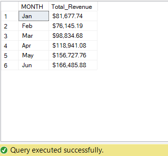
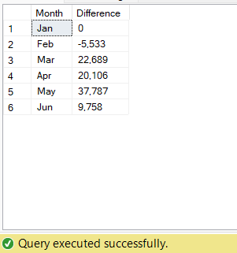
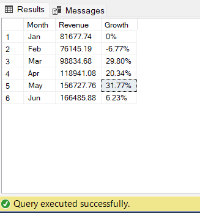
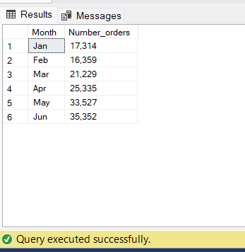
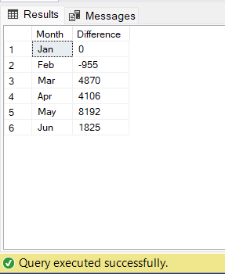
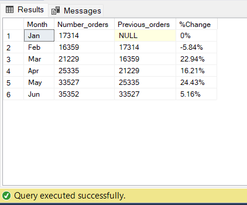
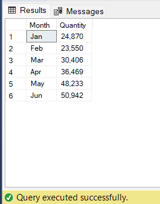
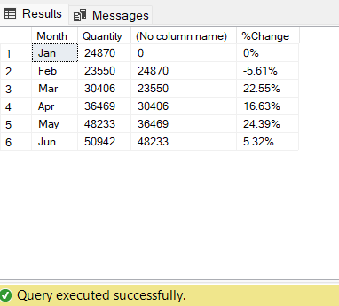
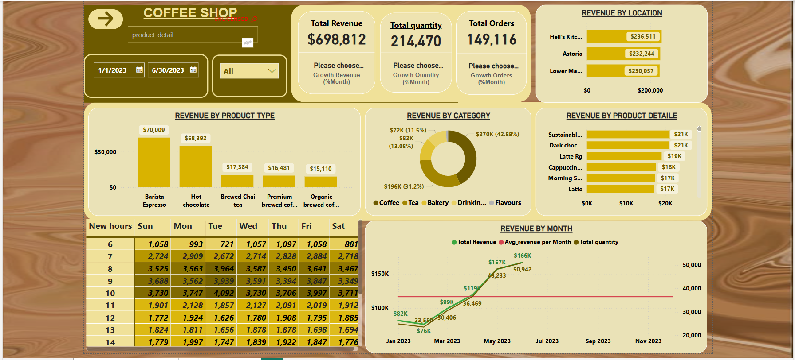
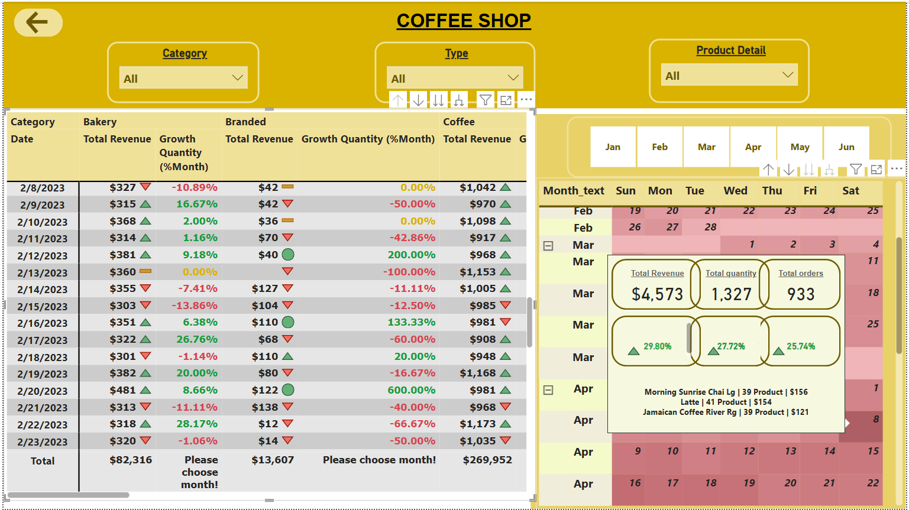

# Coffee Shop Analysis (Phân tích tình hình kinh doanh cửa hàng Cà phê) ☕

## Introduction (Giới Thiệu) 📚

Nhằm mục đích để phân tích 📊 dữ liệu tổng quan về hoạt động kinh doanh của quán từ đó giúp có được 🔎 cái nhìn tổng quan cũng như ra quyết định chiến lược, kế hoạch cho việc 📈 phát triển của quán

## Problems (Vấn đề) ⁉️
### Những vấn đề (yêu cầu) 🔍 về việc phân tích hoạt động kinh doanh của quán:

1. Tính tổng doanh số cho từng tháng tương ứng.
2. Xác định mức chênh lệch doanh số so với tháng trước đó.
3. Xác định mức tăng hoặc giảm doanh số theo tháng.
4. Tính tổng số lượng đơn Order cho từng tháng tương ứng.
5. Xác định mức chênh lệch lượng đơn Order so với tháng trước đo.
6. Xác định mức tăng hoặc giảm lượng đơn Order theo tháng.
7. Tính tổng sản lượng bán được cho từng tháng.
8. Xác định mức chênh lệch sản lượng.
9. Xác định mức tăng hoặc giảm sản lượng bán được.

## Tool I Used (Những công cụ sử dụng trong bài phân tích này) 🛠️

- **SQL Server:** Dùng để truy vấn (query)
  
- **Power BI:** Trực quan hóa những truy vấn thành bảng biểu, biểu đồ
  
- **Github:** Đăng những câu truy vấn, file dữ liệu cũng như file trực quan hóa dữ liệu để chia sẻ cho mọi người và bài phân tích của cá nhân tôi. Để mọi người có thể tham khảo cũng như đóng góp ý kiến cho tôi.

## The Analysis (Phân tích) 📈

1. Tính tổng doanh số cho từng tháng tương ứng
```sql
SELECT
  MONTH,
  FORMAT(SUM(Revenue),'C') Total_Revenue
FROM sales
GROUP BY Month, DATEPART(month,transaction_date)
ORDER BY DATEPART(month,transaction_date) asc
```


2. Xác định mức chênh lệch doanh số so với tháng trước đó

```sql
WITH Table1 as   # Tạo một table đầu tiên với cột tháng (giá trị tháng bằng số)
  (SELECT
    Month,
    SUM(revenue) Revenue,
    DATEPART(month,transaction_date) Month_num
  FROM Sales
GROUP BY month, DATEPART(month,transaction_date))
------
SELECT
  Month,
  # Tính sự chệnh lệch nếu là % thì sau trừ rồi chia cho tháng trước đó
  ISNULL(FORMAT((Revenue - Previous_qty),'N0'),0) AS Difference 
FROM 
  (SELECT 
    Month,
    Revenue,
    LAG(Revenue) OVER (ORDER BY Month_Num) Previous_qty
FROM Table1) AS Table2   # Tạo thêm một bảng phụ với cột và dùng hàm LAG() để lấy doanh thu của tháng trước đó
```


3. Xác định mức tăng hoặc giảm doanh số theo tháng

```sql
WITH table1 as
  (SELECT
    Month,
    SUM(revenue) Revenue,
    DATEPART(MONTH,transaction_date) Month_num
  FROM Sales
  GROUP BY month, DATEPART(MONTH,transaction_date))
-------
SELECT
  Month,
  Revenue,
  ISNULL(CAST(CAST(((Revenue - previous_month)/previous_month)*100 as DECIMAL(5,2)) as VARCHAR(5)), 0)+'%' Growth
FROM 
  (SELECT
    Month,
    Revenue,
    lag(Revenue) OVER (ORDER BY Month_num) Previous_month
  FROM table1) AS Table2;
```


4. Tính tổng số lượng đơn Order cho từng tháng tương ứng

```sql
SELECT
  Month,
  FORMAT(COUNT(transaction_id),'N0') Number_orders
FROM Sales 
GROUP BY Month, DATEPART(month, transaction_date)
ORDER BY datepart(month,transaction_date) asc
```


5. Xác định mức chênh lệch lượng đơn Order so với tháng trước đo

```sql
With table1 as 
  (SELECT
    Month,
    COUNT(transaction_id) Number_orders,
    DATEPART(month, transaction_date) Month_num
  FROM Sales
  GROUP BY Month, DATEPART(month, transaction_date))
---------
SELECT
  Month,
  ISNULL((Number_orders - Previous_orders),0) Difference 
FROM 
  (SELECT 
    Month,
    Number_orders, 
    LAG(Number_orders) OVER (ORDER BY (month_num)) Previous_orders
  FROM table1) AS Table2
```


6. Xác định mức tăng hoặc giảm lượng đơn Order theo tháng

```sql
WITH table1 as
  (SELECT
    Month,
    COUNT(transaction_id) Number_orders,
    DATEPART(MONTH,transaction_date) Month_num
  FROM sales
  GROUP BY month, DATEPART(month,transaction_date))
-----------
SELECT 
  Month,
  Number_orders,
  Previous_orders, 
  ISNULL(CAST(CAST((Number_orders - Previous_orders)/(CAST(Number_orders as float))*100 as DECIMAL(5,2)) as VARCHAR(5)),0)+'%' '%Change'
FROM 
  (SELECT 
    Month,
    Month_num, Number_orders,
    LAG(number_orders) OVER (ORDER BY month_num) Previous_orders
  FROM table1) as table2;
```


7. Tính tổng sản lượng bán được cho từng tháng

```sql
SELECT
  Month,
  FORMAT(SUM(transaction_qty),'N0') Quantity
FROM Sales 
GROUP BY Month, DATEPART(month, transaction_date)
ORDER BY datepart(month,transaction_date) asc
```


8. Xác định mức chênh lệch sản lượng.

```sql
With table1 as 
  (SELECT
    Month,
    SUM(transaction_qty) Quantity,
    DATEPART(month, transaction_date) Month_num
FROM Sales
GROUP BY Month, DATEPART(month, transaction_date))
---------
SELECT
  Month,
  ISNULL(FORMAT((Quantity - Previous_qty),'N0'),0) Difference 
FROM 
  (SELECT 
    Month,
    Quantity, 
    LAG(Quantity) OVER (ORDER BY (month_num)) Previous_qty
FROM table1) AS Table2
```


9. Xác định mức tăng hoặc giảm sản lượng bán được.

```sql
WITH table1 as
  (SELECT
    Month,
    SUM(transaction_qty) Quantity,
    DATEPART(MONTH,transaction_date) Month_num
FROM sales
GROUP BY month, DATEPART(month,transaction_date))
-----------
SELECT 
  Month,
  Quantity,
  ISNULL(Previous_qty,0), 
  ISNULL(CAST(CAST((Quantity - Previous_qty)/(CAST(Quantity as float))*100 as DECIMAL(5,2)) as VARCHAR(5)),0)+'%' '%Change'
FROM 
  (SELECT 
    Month,
    Month_num,
    Quantity,
    LAG(Quantity) OVER (ORDER BY month_num) Previous_qty
FROM table1) as table2;
```


## Conclusion (kết luận) 📝

### Tổng quan:

  Trong năm 2023, tổng doanh thu cửa hàng thu Coffee được đạt khoảng 698.812 nghìn USD. Ước tính doanh thu trung bình trong khoảng 6 tháng đầu năm 2023 đạt khoảng 116.47        nghìn USD/tháng.
  
  Tổng Doanh số (số lượng sản phẩm) bán được ước đạt sấp xỉ khoảng 214 nghìn các loại sản phẩm (214,470 sản phẩm) của cửa hàng. Trung bình số lượng sản phẩm bán được trong      nửa đầu năm 2023 đạt trung bình khoảng 36 nghìn (35,745) sản phẩm/ tháng.
  
  Số lượng đơn đặt hàng (số lượng orders) đạt khoảng 149 nghìn đơn (149,116 đơn hàng), trung bình 1 tháng có khoảng gần 25 nghìn orders (24,853), cụ thể số lượng đơn hàng       trên ngày đạt 824 orders. Ngoài ra, số lượng sản phẩm trên một đơn hàng bằng 1, qua đó cho thấy số lượng với mỗi lần khách hàng orders phần lớn chỉ có 1 sản phẩm.

### Doanh số:

- **Theo thời gian:**

  Khi nhìn vào biểu đồ chúng ta thấy được sự tăng trưởng tương doanh thu tương đối mạnh mẽ trong giai đoạn nửa đầu năm 2023 (1/2023 – 6/2023). Cụ thể doanh doanh thu có sự      sụt giảm nhẹ (6.77%) trong tháng 2 so với tháng 1, nhưng những tháng sau đó lại có sự tăng trưởng mạnh qua từng tháng. Tính từ tháng 2 cho đến tháng 5 thì trung bình có       sự tăng trưởng khoảng 27.3%/ tháng, nhưng tới tháng 6 thì đà tăng trưởng có phần hạ bớt nhiệt với ghi nhận sự tăng trưởng trong doanh thu chỉ tăng khoảng 6.23% so với         tháng 5 trước đó.

  

## Dựa vào file Power BI có thể có cái nhìn trực quan hơn (sau đây là một vài hình ảnh chart, table từ file Power BI)




